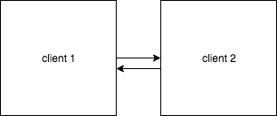

# Conformance testing procedure

The relay client contains the canonical hobbits implementation

### Test 1: Coordinated Start

1. Both clients and the relay are connected as above.  all 3 are started
2. `Eth2Genesis` will be triggered immediately
3. Messages between clients are routed through the relay
4. The relay decodes and ecodes each messages as it pass thru the relay
5. If the clients are able to justify and finalize, then they pass

