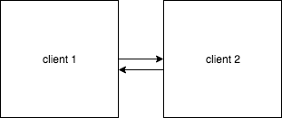

# integration testing procedure

### Test 1: Coordinated Start

1. Both clients are connected as above and started
2. `is_genesis_trigger` will be triggered immediately
3. Messages between clients are routed through the relay
4. The relay decodes and encodes each message as it passes thru the relay
5. If the clients are able to justify and finalize, then they pass

### Test 2: Join & Sync

1. Both clients are connected as above and started
2. Clients run for a couple of epochs
3. A third client joins the network and asks to sync
4. If the new client can successfully sync and all 3 continue to finalize the chain, then they pass

