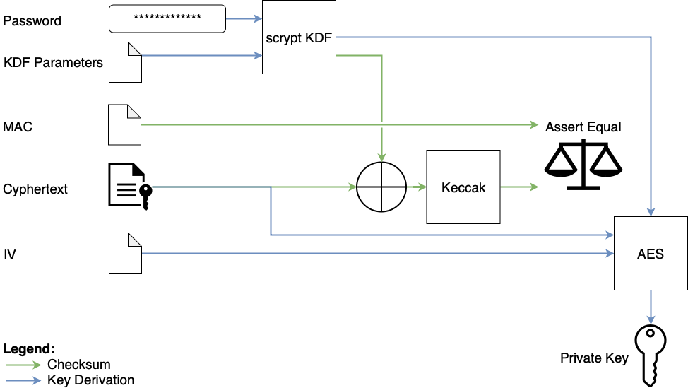

# Keystore Specification for Eth2.0

Keystores within Eth2.0 are the same as the [V3 keystores within Eth1.0.](https://github.com/ethereum/wiki/wiki/Web3-Secret-Storage-Definition) The keystores are a JSON file which store an encrypted version of a validator's private key.

Eth2.0. will exclusively use scrypt as the Key Derivation Function for the private keys. This is a slight variation of the Eth1.0 keystores as scrypt MUST be supported and PBKDF2 MUST NOT be used as the KDF for a validator's signing or withdrawal keys.

## A high-level overview of how Keystores work



## Definition

The process of obtaining a keystore can be broken into 3 sub-sections: obtaining the *derived key*, checking the derived key's validity, and obtaining the public key.

### The derived key

The derived key is obtained by combining the externally provided keystore password and the `kdfparams` obtained from within the keystore file. If a keystore file is being generated for the first time, the salt must be obtained from a CSPRNG.

```python
derived_key = scrypt(password, dklen, n, p, r, salt)
```

### Checking the derived key's validity

The derived key's validity is checked by determining whether the Keccak256-hash of the second 16 bytes (from the left) of the `derived_key` and the `ciphertext`, yields the `mac`.

```python
assert keccak256(derived_key[16:32] + ciphertext) == mac
```

### Obtaining the private key

Finally, the private key can be obtained from the first 16 bytes of the `derived_key`, the `ciphertext` and the `iv` obtained from the `cipherparams`. These parameters are fed into AES-128 in counter mode and yield the private key as a big-endian encoded uint256.

```python
private_key = aes_128_ctr(derived_key[:16], ciphertext, iv)
```

## UUIDs

The ID provided in the keystore is randomly generated and is designed to be used as a 128-bit proxy for referring to a set of keys or account. This level of abstraction provides a means of preserving privacy for a secret-key.

## Test vectors

The following test vector is taken directly from the Eth1 keystore definition:

Test values:

* Password: `testpassword`
* Secret: `7a28b5ba57c53603b0b07b56bba752f7784bf506fa95edc395f5cf6c7514fe9d` (Note that this secret is not a valid BLS12-381 private key as it is bigger than the curve order.)

```json
{
    "crypto" : {
        "cipher" : "aes-128-ctr",
        "cipherparams" : {
            "iv" : "83dbcc02d8ccb40e466191a123791e0e"
        },
        "ciphertext" : "d172bf743a674da9cdad04534d56926ef8358534d458fffccd4e6ad2fbde479c",
        "kdf" : "scrypt",
        "kdfparams" : {
            "dklen" : 32,
            "n" : 262144,
            "p" : 8,
            "r" : 1,
            "salt" : "ab0c7876052600dd703518d6fc3fe8984592145b591fc8fb5c6d43190334ba19"
        },
        "mac" : "2103ac29920d71da29f15d75b4a16dbe95cfd7ff8faea1056c33131d846e3097"
    },
    "id" : "3198bc9c-6672-5ab3-d995-4942343ae5b6",
    "version" : 3
}
```

## FAQs

**Why are keystores needed at all?**

Keystores provide a common interface for all clients to ingest validator credentials. By standardising this, switching between clients becomes easier as there is a common interface through which to switch.

**Why reuse Eth1 keystores?**

* Users are already familiar with what they are and how to use them.
* There already exists a lot of keystore tooling that we (as a community) can make use of.

**Why use scrypt over PBKPRF2?**\

scyrpt and PBKPRF2 both rely on the security of their underlying hash-function for their safety, however scrypt additionally provides memory hardness. The benefit of this is greater ASIC resistance meaning brute-force attacks against scyrpt are generally slower and harder.

**Why not support PBKPRF2?**

It is not that PBKPRF2 is bad (in fact it is a part of scrypt under the hood), it is just nice to present a simplified keystore with fewer versions so that client implementors need only support a single function.

**Why are private keys encoded with Big Endian?**

This is done because it is how keys are stored in Eth1 and because it is is the standard of most of the crypto libraries.

**Why is Keccak used, doesn't it introduce another security assumption and dependency?**

Because Keccak will haunt Ethereum forever.

Seriously though, clients already need Keccak as a dependency for following the Eth1 chain and in this case the security of the hash function used has no baring on the security of one's private keys.
